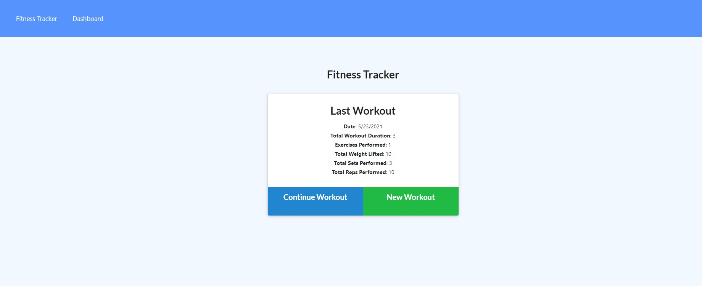
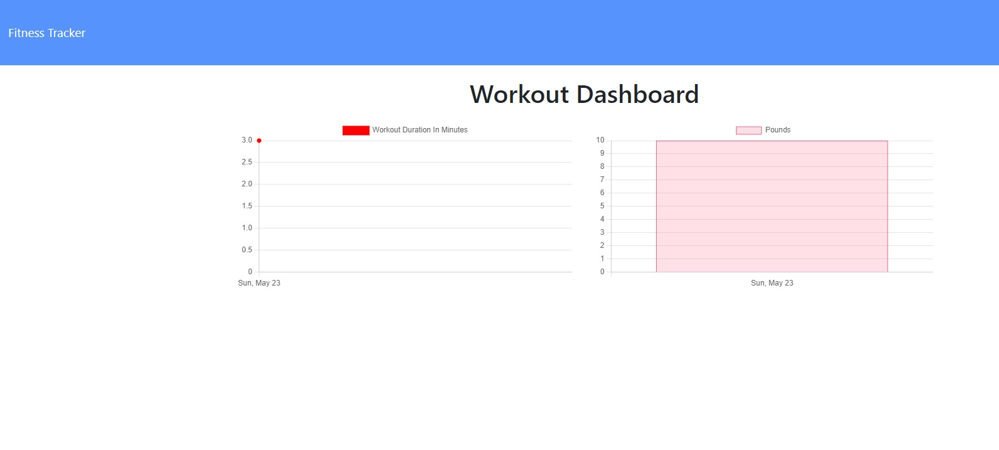

# workout_tracker
## Description
Exercise tracker where you can add the amount of reps, duration, weight etc. that way the user can keep a record and evaluate its progress.
## Demo
link to deployed demo : https://letsworkouttracker.herokuapp.com/


## Table of Contents 
* [Installation](#installation)
* [Contributing](#contributing)
* [Questions](#questions)
## Installation
To install necessary dependencies, run the following command:
```
npm i
```
make sure to add a .env file with the URL for your mongodb database.
## Questions
If you have any questions about the repo, open an issue or contact me directly at nicollas@gmail.com. 
You can find more of my work at [nickverneck](https://github.com/nickverneck/).

